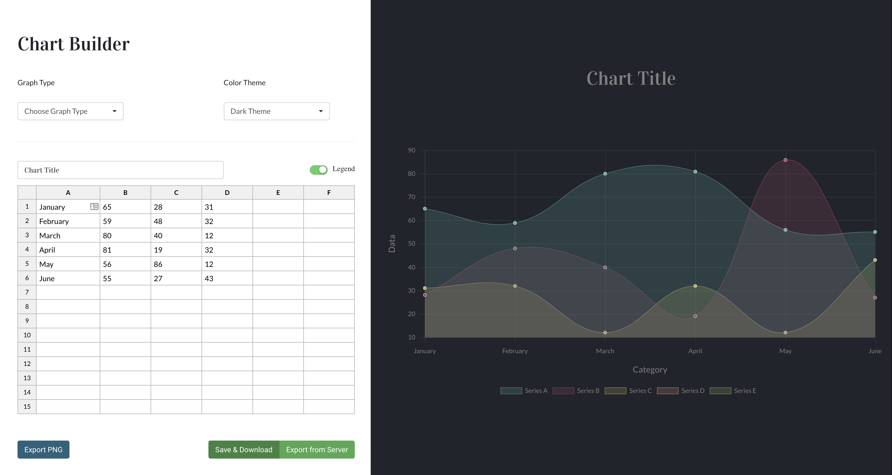

# Chart Builder AngularJS #

### Synopsis
_Chart Builder_ is a web app that lets you build four different types of charts (line, bar, pie and radar) with two different color themes (light and dark theme). You can add data to the spreadsheet, change its title, and add a legend to see the chart updated automatically.

### Technologies Used
- AngularJs
- Chart.js
- Angular Components
- Bootstrap
- HTML, CSS and JS

### Dashboard View

### How to use
- git clone
- npm install
- npm run dev 

### Things to do
- [ ] Make responsive
- [ ] Update controllers to make more dry
